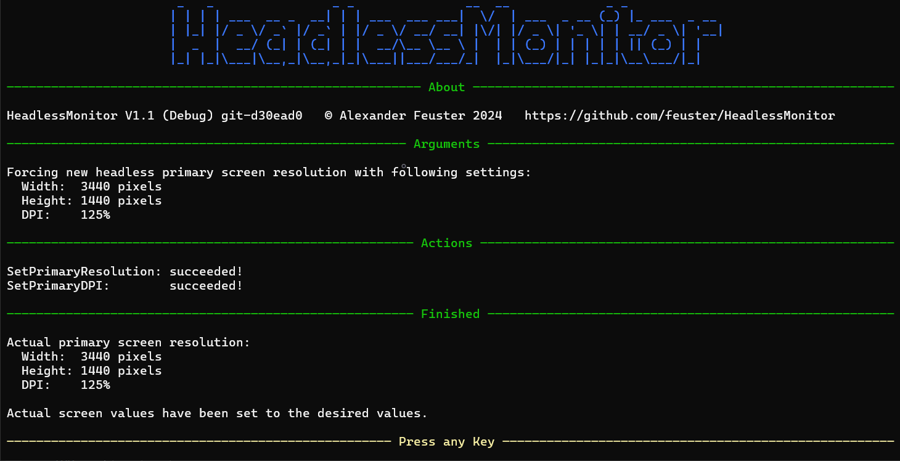

# HeadlessMonitor

HeadlessMonitor can set a new resolution in a Windows system which is used headless without physical monitor

## Usage

Short Argument | Long Argument | Setting
:---: | :---: | :---
-w | --width | the new headless resolution pixel width
-h | --height | the new headless resolution pixel height
-d | --dpi | the new headless resolution DPI in percent
-c | --close | close HeadlessMonitor on errors and after finishing
| --help | opens the help page

  Example:  "HeadlessMonitor.exe --width 1920 --height 1080 --dpi 125"

## Copyright

© Alexander Feuster 2024

## License

HeadlessMonitor is licensed under the [MIT-License](./LICENSE)
